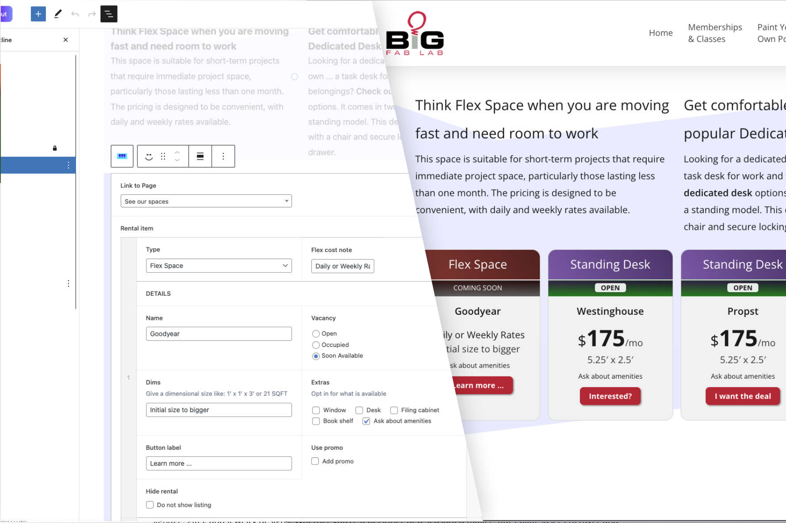

## WEBSITE REDESIGN

## Synopsis

The [BiG Fab Lab](https://bigfablab.com/) is a makerspace in Bowling Green, Ohio. The website was built with WordPress and the Salient theme. The site made a poor use typography, color and content. The owners  wanted wanted a fresh, modern look and feel that would be responsive, and utilize their vast library of images to showcase the space and the work of their members. They also wanted to make it easier for visitors to find information about the equipment and tools available at the makerspace, and to make it easier for members to reserve equipment and tools. They needed a friendly way to drive visitors to request and sign up for events and classes. 

### Key Achievements

- To move quickly, I decided to abandon WPBakery theme builder and instead added [Qubely Advanced Gutenberg blocks](https://wordpress.org/plugins/qubely/)  to the [Salient](https://themenectar.com/salient/) theme. This enabled me to quickly assemble standard design patterns for the landing page while taking my time on creating reusable plugins for the custom pages.
- For the homepage, I created a card box design with CTA button to launch reservation forms and jump to other pages.
- For two interior pages, I built a custom Gutenberg block to list the equipment and tools available at the makerspace.
- For the second custom page, I built a custom Gutenberg block to list rental spaces available at the makerspace.
- Forms are built with Gravity Forms and are integrated with Mailchimp newsletter posts.

## Custom Plugins

### ACF Tooling Block

This was my first attempt at creating a Gutenberg block plugin. I used the ACF block builder template to create a custom block that would list the [tools and equipment](https://bigfablab.com/facilities/tools/) available at the makerspace. The block is built with a repeater field that allows the user to add a title, description, and link to a manual for each tool. The block is styled with CSS Grid and Custom Properties. Combined with Qubely blocks, I placed the list inside an accordion block to collapse long lists. 

The view it replaces was a hard to read table with no context. It was generated when they were seeking various tools and equipment donations. The new view is much more readable and provides context for each tool. Visitors of the site are impressed that they have access to user manuals for some of the tools.
 

### ACF Rental Block

As my second Gutenberg block plugin project, I used the ACF block builder to create a custom block that would list the [rental spaces](https://bigfablab.com/facilities/storage-studio/) available at the makerspace. The block is built with a repeater field that allows the user to add a title, description, and pricing for each space. The block is styled as a card with a strong call to action button. Integrated with Qubely blocks, I added background shapes to increase visual interest.

Each space card has a CTA button that launches a Gravity Form to request a tour. Each type of rental uses a unique color pattern plus the name of a famous Ohio inventor. 